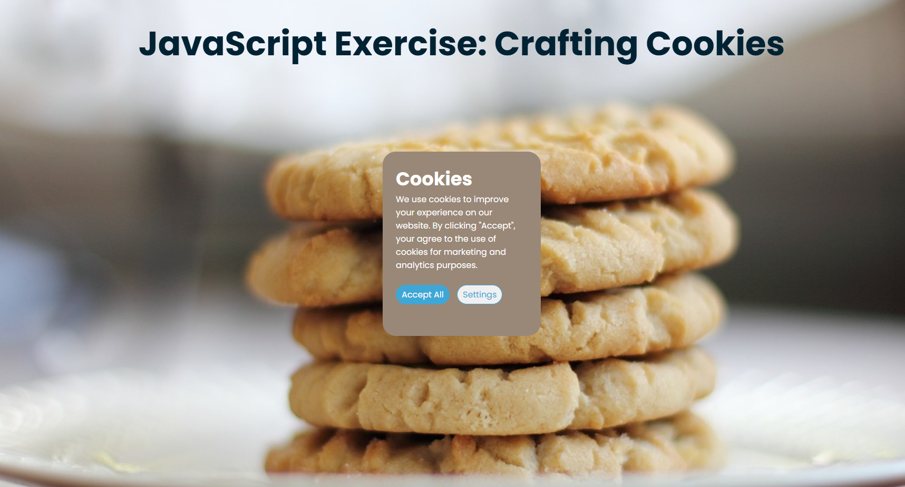

# JavaScript Exercise: Cookie Crafter
## Overview
The website Cookie Dialogue allows users to manage cookie preferences. Upon visiting, users are presented with a dialogue box where they can either accept all cookies or configure specific settings, such as allowing cookies related to the operating system, browser, screen width, and screen height. The user's preferences are saved through cookies, which can be modified via toggles before confirming the settings with a "Save Preferences" button.
## Features
- Cookie Management: Users can accept or configure cookie preferences.
- Dynamic Preferences: Toggles for setting cookies based on user data (OS, browser, screen dimensions).
- Persistence: User preferences are saved as cookies, enabling future customizations.
### Languages Used 

### Say Hi
If you have an comments or suggestions, please don't hesitate to reach out :)

